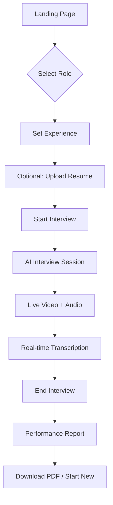

# AgentNexus - Premium AI Mock Interview Platform

<div align="center">


**Real interviews. Real feedback. Zero pressure.**

[Live Demo](https://lovable.dev/projects/f8434f52-4a21-4efc-af07-69efdf111801) • [Documentation](https://docs.lovable.dev/)

</div>

---

## ✨ Features

### 🎯 Core Functionality
- **AI-Powered Interviews** - Practice with a sophisticated AI interviewer using Vapi AI
- **Real-Time Video** - See yourself during the interview with live webcam integration
- **Voice Interaction** - Natural voice conversation with speech recognition
- **Smart Feedback** - Comprehensive post-interview analysis and scoring

### 🎨 Premium Design
- **Particle Background** - Beautiful animated particles for immersive experience
- **Dark Mode** - Full dark mode support with seamless transitions
- **Smooth Animations** - Framer Motion powered micro-interactions
- **Responsive Layout** - Perfect on desktop, tablet, and mobile

### 📄 Advanced Features
- **Optional Resume Upload** - Upload PDF resume for enhanced feedback (10MB max)
- **Live Transcription** - Real-time conversation transcript display
- **Performance Metrics** - Detailed scoring on confidence, clarity, and content
- **PDF Export** - Download beautiful branded interview reports
- **Progress Tracking** - Visual progress indicators and session timer

---

## 🚀 Quick Start

### Prerequisites
- Node.js 18+ and npm
- [Vapi AI Account](https://vapi.ai) (for API key)

### Installation

1. **Clone the repository**
```bash
git clone <YOUR_GIT_URL>
cd agentnexus
```

2. **Install dependencies**
```bash
npm install
```

3. **Set up environment variables**
```bash
cp .env.example .env
```

Edit `.env` and add your Vapi AI public key:
```env
VITE_VAPI_PUBLIC_KEY=your_vapi_public_key_here
```

> 🔑 Get your Vapi API key from [Vapi Dashboard](https://dashboard.vapi.ai)

4. **Start development server**
```bash
npm run dev
```

The app will be available at `http://localhost:8080`

---

## 🎯 How It Works

### User Flow



### Tech Stack

- **Frontend**: React 18 + TypeScript + Vite
- **Styling**: Tailwind CSS + shadcn/ui components
- **Animations**: Framer Motion + tsParticles
- **AI Voice**: Vapi AI (Assistant ID: `073fcbe8-ce22-43ac-be1a-1f2c2ff77751`)
- **Video**: React Webcam
- **PDF Generation**: jsPDF + html2canvas
- **Routing**: React Router v6

---

## 📁 Project Structure

```
src/
├── components/
│   ├── ui/                  # shadcn UI components
│   ├── AvatarAgent.tsx      # AI avatar with animations
│   ├── UserVideo.tsx        # Webcam integration
│   ├── ParticleBackground.tsx
│   ├── ResumeUpload.tsx     # Drag-and-drop file upload
│   └── MetricCard.tsx       # Performance metric display
├── pages/
│   ├── Index.tsx            # Landing page with settings
│   ├── InterviewRoom.tsx    # Split-screen interview UI
│   ├── Report.tsx           # Post-interview feedback
│   └── NotFound.tsx         # 404 page
├── lib/
│   ├── vapi.ts              # Vapi AI integration
│   └── utils.ts             # Utility functions
├── hooks/                   # Custom React hooks
└── index.css                # Design system & animations
```

---

## 🎨 Design System

### Colors (Dull Red Accent)

```css
/* Light Mode */
--accent-red-light: #FECACA
--accent-red: #F87171
--accent-red-dark: #EF4444

/* Backgrounds */
--background: #FAFAFA / #F9FAFB
--card: #FFFFFF
```

### Key Animations

- `animate-breathe` - Breathing avatar effect
- `animate-pulse-glow` - Pulsing glow for speaking state
- `animate-float` - Floating elements
- Particle system with slow drifting movement

---

## 🚢 Deployment

### Deploy to Vercel

1. Push code to GitHub
2. Import project in Vercel
3. Add environment variable: `VITE_VAPI_PUBLIC_KEY`
4. Deploy!

### Deploy via Lovable

1. Click **Publish** in the Lovable editor
2. Add your Vapi API key in project settings
3. Click **Update** to deploy changes

---

## 🔧 Configuration

### Vapi AI Assistant

The app uses a pre-configured Vapi AI assistant. To customize:

1. Create a new assistant in [Vapi Dashboard](https://dashboard.vapi.ai)
2. Update `ASSISTANT_ID` in `src/lib/vapi.ts`
3. Configure interview questions and behavior in Vapi

### Resume Upload

- **Max file size**: 10MB
- **Accepted format**: PDF only
- **Storage**: Client-side only (not uploaded to server)
- **Usage**: Enhances feedback analysis

---

## 📊 Features Roadmap

- [ ] Backend integration for persistent data
- [ ] User accounts and session history
- [ ] Advanced analytics dashboard
- [ ] Custom interview templates
- [ ] Multi-language support
- [ ] Mobile app (React Native)

---

## 🤝 Contributing

Contributions are welcome! Please feel free to submit a Pull Request.

---

## 📄 License

This project is built with [Lovable](https://lovable.dev) and is licensed under MIT.

---

## 🔗 Links

- **Live Demo**: [AgentNexus on Lovable](https://lovable.dev/projects/f8434f52-4a21-4efc-af07-69efdf111801)
- **Vapi AI**: [vapi.ai](https://vapi.ai)
- **Documentation**: [Lovable Docs](https://docs.lovable.dev)
- **Support**: [Discord Community](https://discord.gg/lovable)

---

<div align="center">

**Built with ❤️ using [Lovable](https://lovable.dev)**

*Making interview practice accessible to everyone*

</div>
